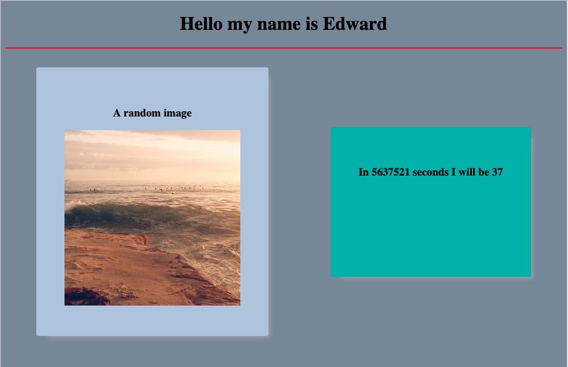

# Assessment One

This assesment should be turned in before class and requires that you have completed the list of pre-work [assets](https://github.com/Montana-Code-School/Setup-Prework/blob/master/MISSOULA_FT.md#summary-checklist).  Without the things in this list this repo will not work properly.

## Getting started

### Install and start your server

You are reading this, so there is the assumption that you have [forked](https://help.github.com/articles/fork-a-repo/) and cloned this repo if that is not the case then `cd` into your code folder and run `git clone <remote path>`.  the remote path bit at the end there is a common placeholder and should be replaced with something like this:  `git@github.com:<your username>/first-assesment.git`

If you have cloned it, rad, `cd` into it and run

``` bash
npm install
```

from your command line.  Some things will happen.  Once those things are done open your text editor and take a look at the files.  for this activity you will be working in public.  Don't worry about the rest unless things aren't working as planned you shouldn't need to worry about the rest.

Jump back to your terminal real quick and run

``` bash
node server.js
```

this will invoke the server script and serve your files to the browser, during local development your port will be 3000.  Open Chrome and navigate to `http://localhost:3000`

### Objective

In software engineering this is often called a spec which is short for a [specifications sheet](https://en.wikipedia.org/wiki/Software_requirements_specification).  A spec can go from extremely basic to extensive. Today we are going to go with basic.

Be the end of this exercise you should have a very simple webpage. There are a few requirements for this basic application:

- [ ] a centered header that introduces you by name
- [ ] two boxes below the header with more than no styling on them
- [ ] the boxes should stack as the screen is resized
- [ ] the left box should have a random image in it
- [ ] the image should have an alt tag
- [ ] the right box should contain a counter that is counting down to your next closest birthday
- [ ] the counter should actively update
- [ ] you application should be remotely accessable through heroku
- [ ] you application should have a favicon

Here is an example:



You are not required to choose such hideous colors.

### Completing the activity

When you have completed all of the checkboxes on the spec above.  Jump into slack and post your heroku remote path to the pre-work channel with a brief comment about why it is so amazing.

### A few hints

Googling is going to be your friend.  In this moment and for always. If however you are completely lost:

Javascript has a [Global Date Object](https://developer.mozilla.org/en-US/docs/Web/JavaScript/Reference/Global_Objects/Date)

Heroku CLI makes deployment [a snap](https://devcenter.heroku.com/articles/git#creating-a-heroku-remote)

You will need to refresh the page to see your changes

### Last thing

At the moment, hopefully this does not change, we do not give out grades.  That being said these assessments are meant to give you and us an idea of where you are and what skills you have gained.

Feel free to ask questions, in slack email or wherever, don't expect complete answers, but breadcrumbs, yeh we can do that.
